# Hivo

**Strength training con gamificación cooperativa.** Hivo es un logger de entrenos (competidor directo de Hevy) que añade encima del logging: **clanes de 2–8 personas** con misiones semanales y raids estilo boss-fight, **autorregulación adaptativa** (ajusta el peso prescrito según RPE, sueño y HRV), un **recovery score** diario (0–100) y un **AI Coach** que genera workouts personalizados.

> La métrica norte del producto es **weekly active clan members**: la tesis es que la responsabilidad cooperativa impulsa la retención, no el feed social pasivo.

- **App**: React Native + Expo (SDK 56) + TypeScript estricto + expo-router
- **Backend** (próximamente): Supabase — Auth, Postgres con RLS, Storage, Realtime, Edge Functions
- **Diseño**: cerrado e inmutable; la fuente de verdad visual es el prototipo de `hivo-design/`

---

## Índice

1. [Estado actual — qué funciona hoy](#estado-actual--qué-funciona-hoy)
2. [Capturas](#capturas)
3. [Cómo ejecutarla](#cómo-ejecutarla)
4. [Mapa de navegación](#mapa-de-navegación)
5. [La pantalla Today en detalle](#la-pantalla-today-en-detalle)
6. [Arquitectura del código](#arquitectura-del-código)
7. [Modelo de dominio](#modelo-de-dominio)
8. [Gamificación cooperativa](#gamificación-cooperativa)
9. [Sistema de diseño](#sistema-de-diseño)
10. [Roadmap](#roadmap)
11. [Fuentes de verdad](#fuentes-de-verdad)

---

## Estado actual — qué funciona hoy

El repo contiene **dos cosas**: el prototipo de diseño completo (`hivo-design/`, HTML+React por CDN, abre en navegador) y la **app real Expo en construcción**, que vive en la raíz. El primer hito de la app (spec y plan en `docs/superpowers/`) está **completo**:

| Área | Estado | Detalle |
| --- | --- | --- |
| Scaffold Expo + TS estricto | ✅ | expo-router, alias `@/`, eslint, jest |
| Tema (tokens + tipografía + fuentes) | ✅ | Valores exactos de `hivo-design/tokens.css`; Geist + JetBrains Mono |
| Kit de UI base | ✅ | 24 iconos SVG, Card, Chip, Button, Avatar, Ring, ProgressBar, ScreenHeader, Sheet, Stat |
| Shell de navegación (5 tabs) | ✅ | Tab bar glass con blur (iOS) / fondo opaco (Android), acento en tab activa |
| Datos mock tipados | ✅ | USER, CLAN, WEEK, WARMUPS, FEED, ROUTINES, WORKOUTS, NOTIFICATIONS |
| Lógica de Today (funciones puras) | ✅ | 10 unit tests en verde (`src/lib/today.ts`) |
| **Pantalla Today completa** | ✅ | Hero con 4 estados, week strip + detalle de día, warmups, streak, clan CTA, sheets |
| Tabs Train / Squad / Stats / You | 🔜 | Placeholders ("Coming soon") |
| Logger de entreno activo | 🔜 | Siguiente hito — es la pantalla sagrada del producto |
| Supabase (auth, sync, realtime) | 🔜 | Fuera del alcance del bootstrap |

Verificación del hito: `tsc`, `expo lint` y `jest` en verde, más prueba end-to-end de todas las interacciones con la app corriendo (las capturas de abajo salen de esa sesión).

## Capturas

Todo lo que se ve abajo es la **app real** (React Native corriendo en Expo web), no el prototipo.

<table>
  <tr>
    <td align="center"><b>Today</b><br/><sub>Hero, warmups, semana, streak, clan</sub></td>
    <td align="center"><b>Día pasado</b><br/><sub>Resumen con stats, PR y ejercicios</sub></td>
    <td align="center"><b>Día planificado</b><br/><sub>Plan con ejercicios y reschedule</sub></td>
  </tr>
  <tr>
    <td>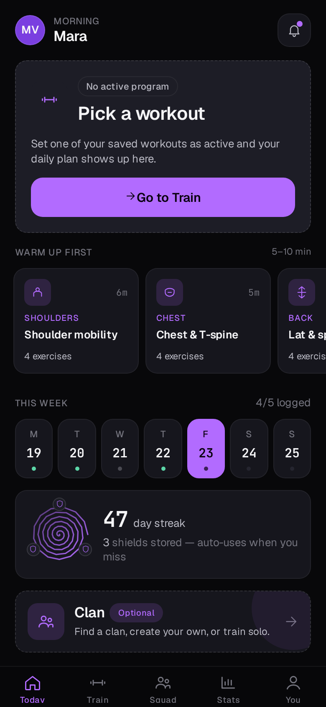</td>
    <td>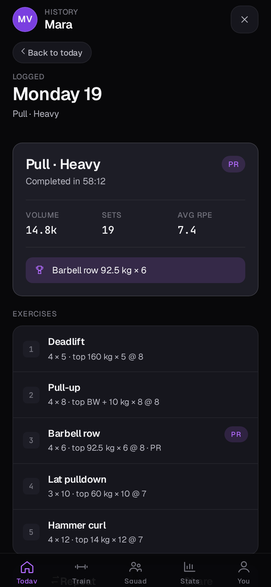</td>
    <td>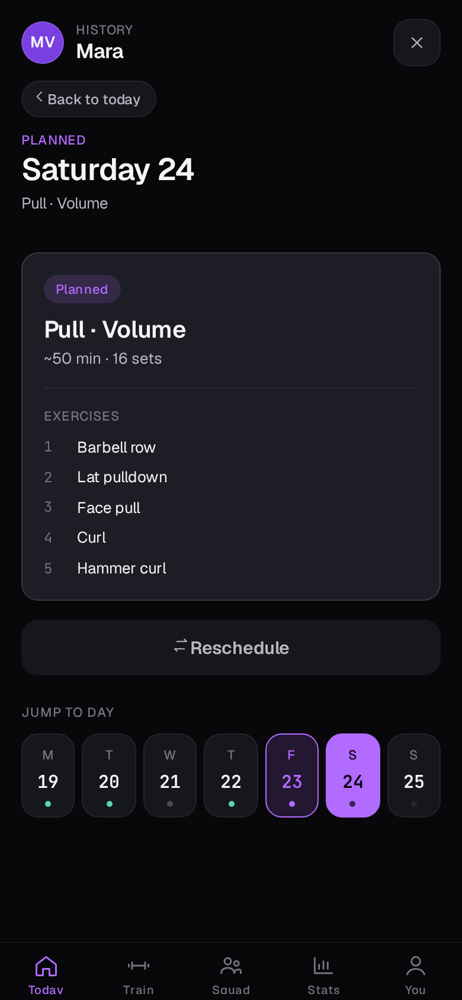</td>
  </tr>
  <tr>
    <td align="center"><b>Día de descanso</b><br/><sub>Recovery como parte del programa</sub></td>
    <td align="center"><b>Warmup sheet</b><br/><sub>Flujo guiado de movilidad</sub></td>
    <td align="center"><b>Notificaciones</b><br/><sub>Raid, PRs, autoreg, misiones</sub></td>
  </tr>
  <tr>
    <td>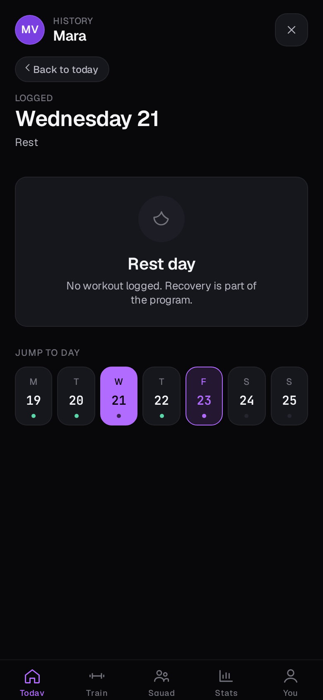</td>
    <td>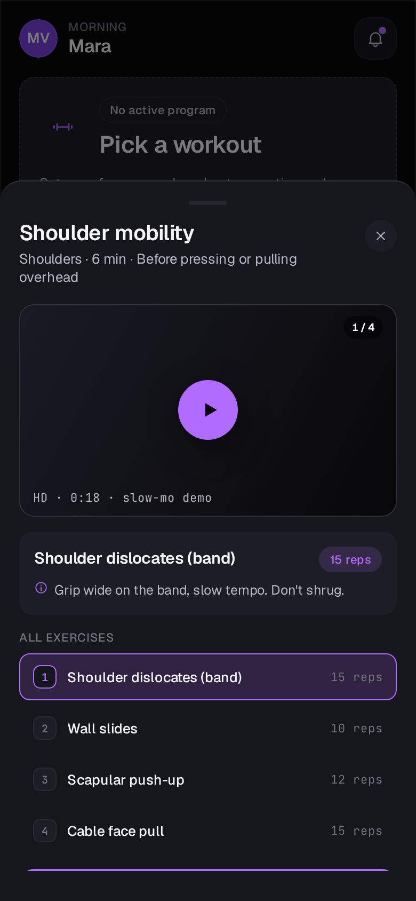</td>
    <td>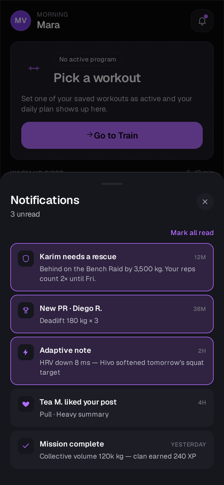</td>
  </tr>
</table>

## Cómo ejecutarla

```bash
npm install
npx expo start        # → 'w' para web, QR para Expo Go (iOS/Android)
```

- **Navegador**: abre `http://localhost:8081` (modo responsive ~390×844 para verla como móvil).
- **Móvil**: instala **Expo Go**, misma WiFi, escanea el QR. En el móvil se ven el blur real del tab bar, las animaciones Reanimated y los sheets nativos.

```bash
npx tsc --noEmit      # typecheck
npx expo lint         # lint
npx jest              # unit tests (lógica de Today)
```

El **prototipo de diseño** se ejecuta aparte: abrir `hivo-design/Hivo Prototype.html` en un navegador (React por CDN, no necesita build).

## Mapa de navegación

Cinco tabs persistentes; las acciones contextuales abren **sheets** (modales bottom-up), nunca pantallas push. El detalle de día es un estado interno de Today, no una ruta.

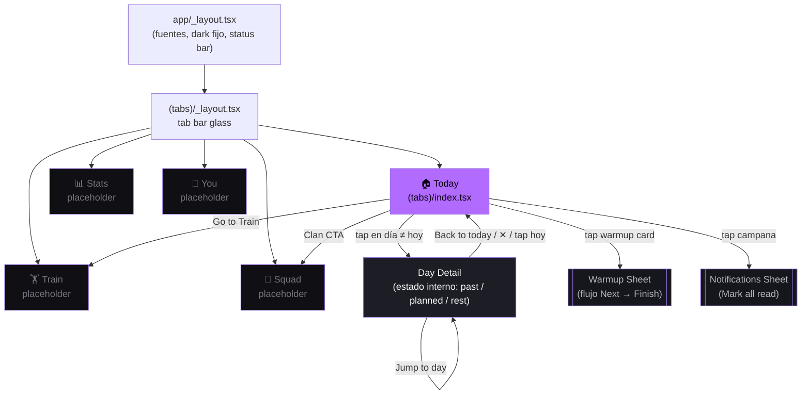

## La pantalla Today en detalle

### Los 4 estados del hero

El hero (`TodayHero`) decide qué mostrar cruzando el **workout activo** del usuario (solo uno puede tener `current: true`) con el **día de la semana actual**:

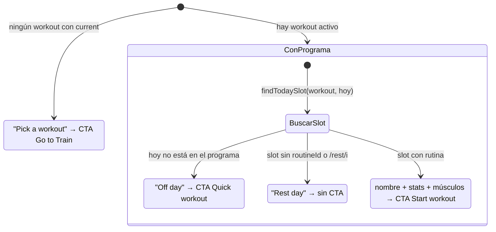

> Estado inicial fiel al prototipo: arranca **sin programa activo** (el flag `current` se activará desde Train cuando esa tab esté portada).

### Flujo de datos de la pantalla

La lógica de fecha/programa está extraída a **funciones puras testeadas** — la pantalla solo compone:

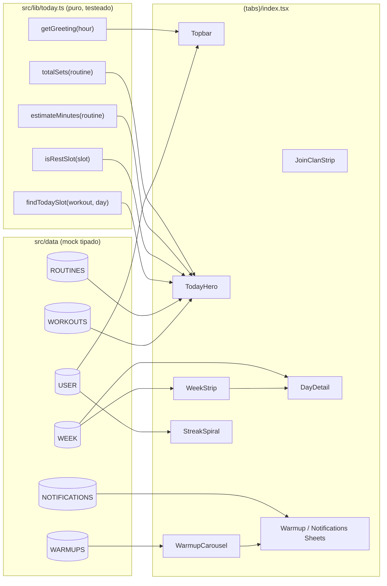

## Arquitectura del código

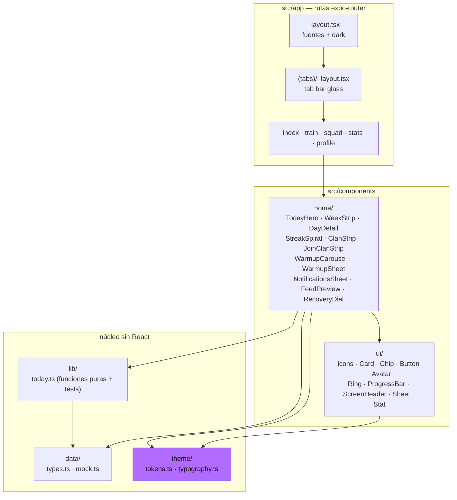

Reglas que mantiene esta estructura:

- **`src/theme` es la única fuente de tokens.** Nada de colores o tamaños hard-coded: todo sale de `tokens.ts`/`typography.ts`, que copian los valores exactos de `hivo-design/tokens.css`. Cada componente se portó leyendo su contraparte del prototipo (el archivo y las líneas van en un comentario de cabecera).
- **Lógica fuera de los componentes.** Lo calculable (slot de hoy, minutos estimados, sets totales) vive en `src/lib` como funciones puras con tests; los componentes solo renderizan.
- **Diferencias de plataforma documentadas.** Lo que la web hace y RN no (blur barato, gradientes en texto, rayas repetidas) se aproxima y se deja comentado en el código (ej.: el glow del hero es el mismo círculo del proto pero sin `blur(40px)`).
- **Mock data tipado como contrato.** `src/data/types.ts` define las shapes que luego reutilizará el backend; `mock.ts` es transcripción literal del prototipo.

### Mapa del repo

| Ruta | Qué es |
| --- | --- |
| `src/app/` | Rutas expo-router (layout raíz + 5 tabs) |
| `src/components/ui/` | Kit base portado del prototipo |
| `src/components/home/` | Componentes de la pantalla Today |
| `src/lib/` | Lógica pura + tests (`__tests__/`) |
| `src/data/` | Tipos del dominio + datos mock |
| `src/theme/` | Tokens canónicos (colores, radios, espaciado, tipografía) |
| `hivo-design/` | **Prototipo de diseño** — fuente de verdad visual, intocable |
| `docs/superpowers/` | Spec y plan de implementación del bootstrap |
| `docs/screenshots/` | Capturas de la app real (las de este README) |
| `CLAUDE.md` | Reglas de diseño, modelo de dominio e insights de producto |

## Modelo de dominio

Jerarquía de tres niveles — no confundirlos:

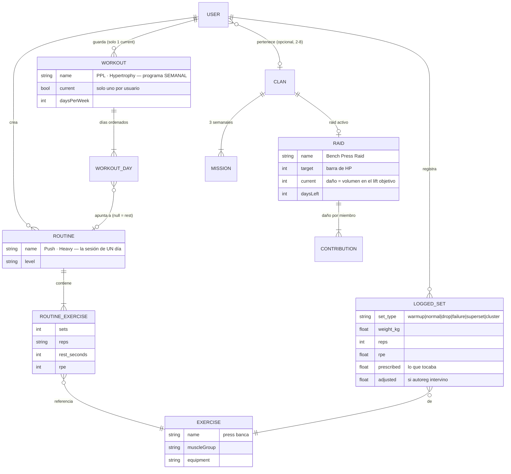

Glosario rápido:

| Término | Significado |
| --- | --- |
| **e1RM** | 1RM estimado (Epley por defecto) |
| **RPE** | Esfuerzo percibido 1–10 |
| **autoreg** | Ajustar la prescripción según readiness (HRV, sueño, RPE previo) — siempre explícito y enmarcado como *sugerencia* |
| **deload** | Semana ligera planificada |
| **shield** | Token que protege el streak ante un día fallado (se auto-usa) |
| **rescue** | Si un miembro del clan se queda atrás, las contribuciones del resto cuentan con multiplicador |

> Los **warmups se excluyen** de los cálculos de volumen.

## Gamificación cooperativa

El bucle social de Hivo está diseñado **anti-toxicidad**: los porcentajes de contribución individual solo los ve el propio usuario, las contribuciones se normalizan contra el historial de cada uno, y salir de un clan no tiene fricción.

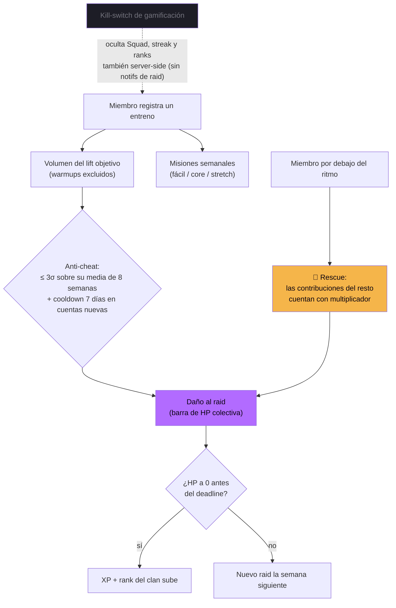

## Sistema de diseño

El diseño está **cerrado**. Ante cualquier duda se copian los valores exactos de `hivo-design/tokens.css` — nunca aproximar ni "mejorar". Resumen de lo canónico:

| Token | Valor |
| --- | --- |
| Tema | Oscuro siempre — no existe modo claro |
| Superficies | `#08080a` → `#101014` → `#16161d` → `#1d1d26` → `#25252f` |
| Bordes | Hairline 0.5px, `rgba(255,255,255,0.06)` / `0.12` |
| Acento | Morado `#b26bff` (`accent-soft` al 16%, deep `#7a3fe0`) |
| Señales | ok `#5cd6a8` · warn `#f5b54a` · err `#ff6b6b` |
| Tipografía | **Geist** para todo; **JetBrains Mono** + tabular nums para pesos, reps y timers |
| Escala | display 34 · h1 26 · h2 20 · h3 17 · body 15 · sm 13 · xs 11 (uppercase) — letter-spacing negativo en títulos |
| Radios | 6 / 10 / **14 (default)** / 20 / 28 / pill |
| Espaciado | Base 4px; inset horizontal de pantalla **18px** |
| Press | `scale(0.97–0.98)`, nunca solo opacidad |
| Animación | `cubic-bezier(0.2, 0.8, 0.2, 1)`, 0.24–0.55s, stagger ~60ms |

La app real **no tiene personalización de tema** (el panel de tweaks del prototipo era herramienta de exploración). La única opción de usuario que sobrevive es el **kill-switch de gamificación**.

## Roadmap

Orden de batalla (el PRD define 40 features en 6 fases; esto es lo inmediato):

1. ✅ **Bootstrap**: tema + kit UI + tabs + Today *(este hito)*
2. 🔜 **Logger de entreno activo** — la pantalla sagrada: se abre 3+ veces/semana; layout hybrid, keypad alcanzable con una mano, números de la sesión anterior visibles (tap para autocompletar)
3. 🔜 **Train**: biblioteca de workouts/rutinas, editores, marcar programa activo
4. 🔜 **Supabase**: auth (Apple/Google/email), persistencia con RLS, **offline-first** (la decisión arquitectónica más importante: los gyms tienen mala señal)
5. 🔜 **Squad**: clanes, raids con Realtime, misiones, feed
6. 🔜 **Stats** (recovery dial ya está portado), **autoreg** explicable, AI Coach

Principios no negociables durante todo el roadmap: **offline-first**, **accesibilidad** (cada elemento interactivo con label/hint, probar con lector de pantalla antes de merge), **localización ES/EN/PT desde el día uno** (cero strings hard-coded — pendiente de introducir i18n antes de Train), y autoreg **siempre como sugerencia**, nunca prescripción.

## Fuentes de verdad

| Tema | Dónde |
| --- | --- |
| Producto / features / fases | `hivo-design/uploads/Hivo_PRD_v1.0.docx` |
| Diseño / UX | El prototipo (`hivo-design/`) — no adivinar reglas que ya codifica |
| Dominio / endpoints / flujos de IA | `BACKEND_CONTEXT.md` (recuperable: `git show 2ee5ad0:backend/BACKEND_CONTEXT.md`; su stack quedó obsoleto por Supabase, el dominio sigue vigente) |
| Reglas para agentes / convenciones | `CLAUDE.md` |
| Spec y plan del bootstrap | `docs/superpowers/specs/` y `docs/superpowers/plans/` |
